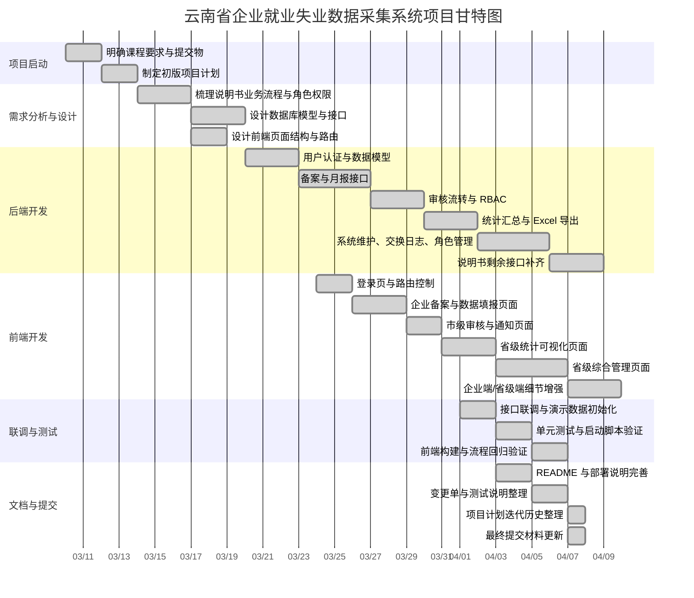

# 云南省企业就业失业数据采集系统甘特图

```mermaid
gantt
    title 云南省企业就业失业数据采集系统项目甘特图
    dateFormat  YYYY-MM-DD
    axisFormat  %m/%d

    section 项目启动
    明确课程要求与提交物              :done, s1, 2026-03-10, 2d
    制定初版项目计划                  :done, s2, after s1, 2d

    section 需求分析与设计
    梳理说明书业务流程与角色权限      :done, a1, 2026-03-14, 3d
    设计数据库模型与接口              :done, a2, after a1, 3d
    设计前端页面结构与路由            :done, a3, after a1, 2d

    section 后端开发
    用户认证与数据模型                :done, b1, 2026-03-20, 3d
    备案与月报接口                    :done, b2, after b1, 4d
    审核流转与 RBAC                   :done, b3, after b2, 3d
    统计汇总与 Excel 导出             :done, b4, after b3, 3d
    系统维护、交换日志、角色管理      :done, b5, after b4, 4d
    说明书剩余接口补齐                :done, b6, after b5, 3d

    section 前端开发
    登录页与路由控制                  :done, c1, 2026-03-24, 2d
    企业备案与数据填报页面            :done, c2, after c1, 3d
    市级审核与通知页面                :done, c3, after c2, 2d
    省级统计可视化页面                :done, c4, after c3, 3d
    省级综合管理页面                  :done, c5, after c4, 4d
    企业端/省级端细节增强             :done, c6, after c5, 3d

    section 联调与测试
    接口联调与演示数据初始化          :done, d1, 2026-04-01, 2d
    单元测试与启动脚本验证            :done, d2, after d1, 2d
    前端构建与流程回归验证            :done, d3, after d2, 2d

    section 文档与提交
    README 与部署说明完善             :done, e1, 2026-04-03, 2d
    变更单与测试说明整理              :done, e2, after e1, 2d
    项目计划迭代历史整理              :done, e3, after e2, 1d
    最终提交材料更新                  :done, e4, 2026-04-07, 1d
```

## 使用说明
- 可将以上 Mermaid 内容粘贴到支持 Mermaid 的 Markdown 编辑器中导出图片。
- 若课程要求单独提交图片版甘特图，可导出为 PNG 后插入 Word 或 PDF。
- 也可将本文件作为“项目计划附件”直接随文档提交。
