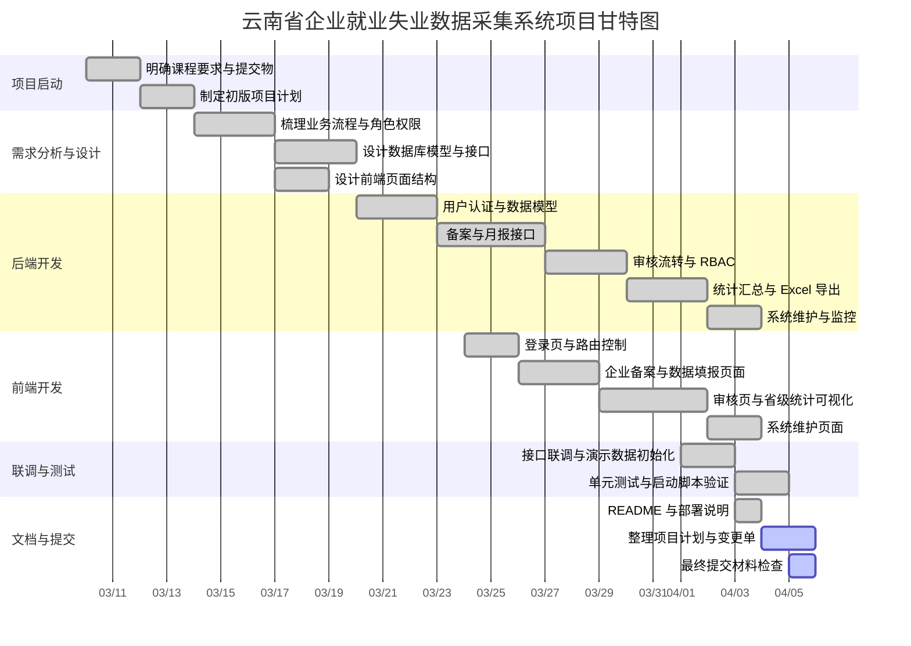

# 云南省企业就业失业数据采集系统甘特图

```mermaid
gantt
    title 云南省企业就业失业数据采集系统项目甘特图
    dateFormat  YYYY-MM-DD
    axisFormat  %m/%d

    section 项目启动
    明确课程要求与提交物          :done, s1, 2026-03-10, 2d
    制定初版项目计划              :done, s2, after s1, 2d

    section 需求分析与设计
    梳理业务流程与角色权限        :done, a1, 2026-03-14, 3d
    设计数据库模型与接口          :done, a2, after a1, 3d
    设计前端页面结构              :done, a3, after a1, 2d

    section 后端开发
    用户认证与数据模型            :done, b1, 2026-03-20, 3d
    备案与月报接口                :done, b2, after b1, 4d
    审核流转与 RBAC               :done, b3, after b2, 3d
    统计汇总与 Excel 导出         :done, b4, after b3, 3d
    系统维护与监控                :done, b5, after b4, 2d

    section 前端开发
    登录页与路由控制              :done, c1, 2026-03-24, 2d
    企业备案与数据填报页面        :done, c2, after c1, 3d
    审核页与省级统计可视化        :done, c3, after c2, 4d
    系统维护页面                  :done, c4, after c3, 2d

    section 联调与测试
    接口联调与演示数据初始化      :done, d1, 2026-04-01, 2d
    单元测试与启动脚本验证        :done, d2, after d1, 2d

    section 文档与提交
    README 与部署说明             :done, e1, 2026-04-03, 1d
    整理项目计划与变更单          :active, e2, 2026-04-04, 2d
    最终提交材料检查              :active, e3, 2026-04-05, 1d
```

## 使用说明
- 可将以上 Mermaid 内容粘贴到支持 Mermaid 的 Markdown 编辑器中导出图片。
- 若课程要求必须单独提交图片版甘特图，可将其导出为 PNG 后插入 Word 或 PDF。
